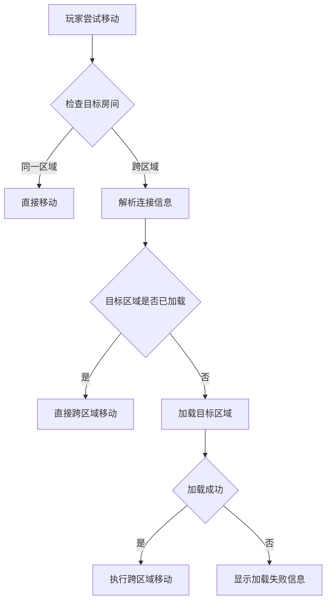

# 跨区域连接引用机制设计

## 概述

基于任务 #2 识别的 38 个跨区域连接点，设计区域间的连接引用机制，确保跨区域房间访问的可靠性和性能。

## 连接机制架构

### 1. 连接引用格式

#### 基本格式
```json
{
  "direction": "north",
  "targetRoomId": "tj_imperial_palace_gate",
  "targetRegion": "imperial",
  "description": "北面通往皇城区正门",
  "exitType": "gate",
  "connectionId": "commercial_to_imperial_001"
}
```

#### 完整格式（推荐）
```json
{
  "direction": "north",
  "targetRoomId": "tj_imperial_palace_gate",
  "targetRegion": "imperial",
  "description": "北面通往皇城区正门",
  "exitType": "gate",
  "connectionId": "commercial_to_imperial_001",
  "connectionType": "bidirectional",
  "loadingRequired": true,
  "preloadData": {
    "regionFile": "tianjing_imperial_district.json",
    "targetLocation": "imperial_palace"
  },
  "distance": 100,
  "travelTime": 5
}
```

### 2. 连接类型分类

#### 2.1 地理连接 (Geographic Connection)
- **特点**: 相邻区域的自然边界连接
- **示例**: 城门连接、街道延伸
- **处理**: 立即加载目标区域数据

```json
{
  "connectionType": "geographic",
  "exitType": "gate",
  "loadingRequired": true,
  "loadStrategy": "immediate"
}
```

#### 2.2 功能连接 (Functional Connection)
- **特点**: 功能驱动的区域连接
- **示例**: 官府到商业区、住宅区到市场
- **处理**: 预加载目标区域数据

```json
{
  "connectionType": "functional",
  "exitType": "door",
  "loadingRequired": true,
  "loadStrategy": "preload"
}
```

#### 2.3 传送连接 (Teleport Connection)
- **特点**: 通过传送阵、马车等快速交通连接
- **示例**: 传送阵、驿站、船坞
- **处理**: 按需加载目标区域

```json
{
  "connectionType": "teleport",
  "exitType": "portal",
  "loadingRequired": true,
  "loadStrategy": "ondemand",
  "teleportType": "array" // array, carriage, boat
}
```

#### 2.4 内部连接 (Internal Connection)
- **特点**: 同一区域内的房间连接
- **处理**: 不需要区域加载

```json
{
  "connectionType": "internal",
  "loadingRequired": false
}
```

## 区域间连接枢纽

### 3. 主要枢纽节点

基于任务 #2 的分析，识别以下关键枢纽：

#### 3.1 四大城门枢纽
- **南门枢纽** (商业区 ↔ 特殊功能区)
- **北门枢纽** (皇城区 ↔ 特殊功能区)
- **东门枢纽** (居民区 ↔ 特殊功能区)
- **西门枢纽** (居民区 ↔ 特殊功能区)

#### 3.2 核心连接枢纽
- **皇宫正门** (皇城区 ↔ 商业区)
- **中央市场** (商业区 ↔ 居民区)
- **城中心广场** (三区交汇点)

#### 3.3 功能性枢纽
- **驿站系统** (连接所有区域)
- **运河码头** (商业区 ↔ 特殊功能区)
- **传送阵网络** (连接重要地点)

## 连接ID命名规范

### 4. 连接标识符格式

#### 格式: `{source_region}_to_{target_region}_{sequence}`

示例:
- `commercial_to_imperial_001`
- `residential_to_commercial_012`
- `special_to_residential_008`

#### 双向连接配对
- `commercial_to_imperial_001` ↔ `imperial_to_commercial_001`
- 两个方向的连接使用相同的序列号

### 5. 特殊连接标识

#### 城门连接
- `gate_south_commercial_to_special_001`
- `gate_north_imperial_to_special_001`

#### 枢纽连接
- `hub_central_plaza_commercial_to_imperial_001`
- `hub_palace_gate_imperial_to_commercial_001`

#### 传送连接
- `teleport_array_imperial_to_residential_001`

## 连接发现和解析机制

### 6. 连接发现流程



### 7. 连接解析器实现

#### 连接数据结构
```typescript
interface RegionConnection {
  connectionId: string;
  sourceRoomId: string;
  sourceRegion: string;
  targetRoomId: string;
  targetRegion: string;
  direction: string;
  connectionType: ConnectionType;
  exitType: ExitType;
  bidirectional: boolean;
  loadingRequired: boolean;
  loadStrategy: LoadStrategy;
  metadata?: ConnectionMetadata;
}

enum ConnectionType {
  GEOGRAPHIC = 'geographic',
  FUNCTIONAL = 'functional',
  TELEPORT = 'teleport',
  INTERNAL = 'internal'
}

enum LoadStrategy {
  IMMEDIATE = 'immediate',
  PRELOAD = 'preload',
  ONDEMAND = 'ondemand'
}
```

#### 连接解析器
```typescript
class RegionConnectionResolver {
  private regionCache: Map<string, RegionData> = new Map();
  private connectionIndex: Map<string, RegionConnection> = new Map();

  async resolveConnection(
    sourceRoomId: string,
    direction: string
  ): Promise<RegionConnection | null> {
    const connectionKey = `${sourceRoomId}_${direction}`;
    const connection = this.connectionIndex.get(connectionKey);

    if (!connection) {
      return null;
    }

    if (connection.loadingRequired && !this.isRegionLoaded(connection.targetRegion)) {
      await this.loadRegion(connection.targetRegion);
    }

    return connection;
  }

  private async loadRegion(regionId: string): Promise<void> {
    // 实现区域加载逻辑
    const regionFile = `tianjing_${regionId}_district.json`;
    const regionData = await this.loadRegionFile(regionFile);
    this.regionCache.set(regionId, regionData);
  }
}
```

## 性能优化策略

### 8. 区域加载优化

#### 8.1 预加载策略
- **核心区域优先**: 皇城区和商业区优先加载
- **相邻区域预加载**: 根据玩家位置预加载相邻区域
- **热点区域缓存**: 频繁访问的连接点保持加载状态

#### 8.2 智能卸载
- **LRU缓存策略**: 最近最少使用的区域优先卸载
- **连接分析**: 没有活跃连接的区域可以安全卸载
- **内存阈值控制**: 根据内存使用情况动态调整缓存

#### 8.3 渐进式加载
```typescript
interface LoadProgress {
  regionId: string;
  status: 'loading' | 'loaded' | 'error';
  progress: number; // 0-100
  criticalRooms: string[]; // 优先加载的关键房间
}

class ProgressiveRegionLoader {
  async loadRegionProgressive(
    regionId: string,
    priorityRooms: string[] = []
  ): Promise<LoadProgress> {
    // 1. 首先加载优先房间（如城门、枢纽点）
    // 2. 然后加载剩余房间
    // 3. 返回加载进度
  }
}
```

### 9. 连接索引优化

#### 9.1 空间索引
```typescript
class SpatialConnectionIndex {
  private spatialIndex: Map<string, RegionConnection[]> = new Map();

  getNearbyConnections(roomId: string, radius: number): RegionConnection[] {
    // 基于空间位置快速查找附近连接
  }

  getRegionConnections(regionId: string): RegionConnection[] {
    // 获取区域的所有外部连接
  }
}
```

#### 9.2 连接缓存
```typescript
class ConnectionCache {
  private connectionCache: Map<string, RegionConnection> = new Map();
  private cacheStats: CacheStats = {
    hits: 0,
    misses: 0,
    evictions: 0
  };

  getConnection(connectionId: string): RegionConnection | null {
    const cached = this.connectionCache.get(connectionId);
    if (cached) {
      this.cacheStats.hits++;
      return cached;
    }
    this.cacheStats.misses++;
    return null;
  }
}
```

## 错误处理和恢复

### 10. 连接错误处理

#### 10.1 连接丢失处理
```typescript
class ConnectionErrorHandler {
  handleConnectionLost(connection: RegionConnection): void {
    // 1. 记录错误日志
    // 2. 尝试重新建立连接
    // 3. 提供替代路径
    // 4. 通知玩家
  }

  async findAlternativePath(
    sourceRoomId: string,
    targetRegion: string
  ): Promise<RegionConnection[] | null> {
    // 寻找到达目标区域的替代路径
  }
}
```

#### 10.2 数据一致性检查
```typescript
class ConsistencyChecker {
  validateCrossRegionConnections(): ConsistencyReport {
    // 验证所有跨区域连接的一致性
    // 检查双向连接的完整性
    // 验证目标房间的存在性
  }
}
```

## 监控和分析

### 11. 连接性能监控

#### 11.1 关键指标
- 跨区域移动延迟
- 区域加载时间
- 连接查找命中率
- 并发连接数量

#### 11.2 性能报告
```typescript
interface ConnectionPerformanceReport {
  reportTime: Date;
  regionStats: RegionStats[];
  connectionStats: ConnectionStats[];
  performanceMetrics: PerformanceMetrics;
}
```

## 实现优先级

### 第一阶段 (MVP)
- 基本跨区域连接机制
- 简单的区域加载策略
- 核心枢纽连接实现

### 第二阶段 (优化)
- 连接缓存和索引优化
- 渐进式加载
- 性能监控

### 第三阶段 (高级)
- 智能预加载策略
- 动态路径优化
- 高级错误恢复

这个设计确保了跨区域连接的可靠性、性能和可维护性，为玩家提供无缝的区域切换体验。